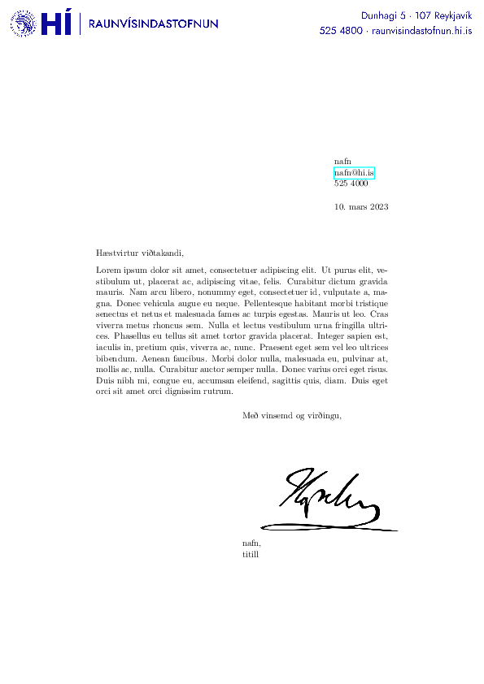
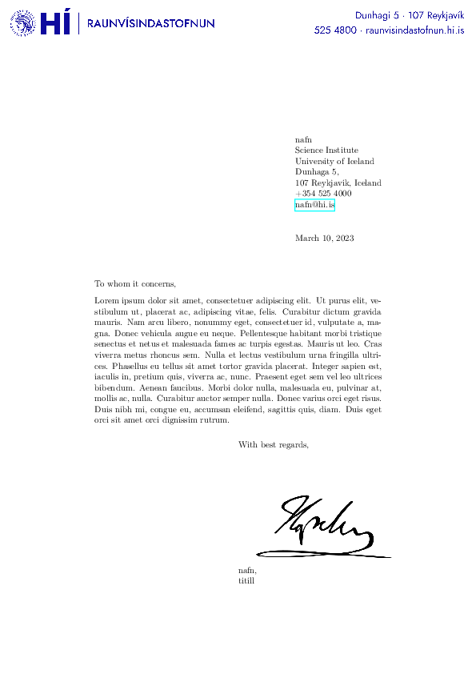

# Bréfsefni (Raunvísindastofnun HÍ)

Hér er íslensk og ensk útgáfa af bréfsefni fyrir Raunvísindastofnun. 

Setja þarf rétt gildi á breyturnar
* NAME
* TITLE (fyri íslensku útgáfuna)
* TITLEENG (fyrir ensku útgáfuna)
* TEL
* EMAIL
og skipta undirskrift.png út fyrir rétta undirskrift.

Fyrir íslenska útgáfu þarf að setja `ICELANDIC` breytuna sem `true`, en `false` fyrir enska útgáfu.

Best er að setja hausinn og undirskriftina á möppu sem geymir sniðmát (t.d. ~/Templates) og breyta tilsvarandi línum, þá er nóg að hafa eitt eintak af hausnum og undirskriftinni og óþarfi að afrita þær skrár í allar möppur. 

Merki fyrir fleiri stofnanir, deildir og svið má finna hér, https://honnun.hi.is/5afb7ec03/p/191b65-myndmerki-h/b/612d94

# Letterhead (Science Institute - University of Iceland)

Here is an Icelandic and English versions of a letter material for The Science Institute.

Theese variables must be set
* NAME
* TITLE (for the Icelandic version)
* TITLEENG (for the English version)
* TEL
* EMAIL
and replace signature.png with the your signature.

For an Icelandic version set the `ICELANDIC` variable as `true`, but `false` for the English version.

It is best to put the header and signature in a folder that stores templates (e.g. ~/Templates) and change the corresponding lines, then it is enough to have one copy of the header and signature and no need to copy those files to all folders.

Logos for more institutions, departments and schools can be found here, https://honnun.hi.is/5afb7ec03/p/191b65-myndmerki-h/b/612d94

